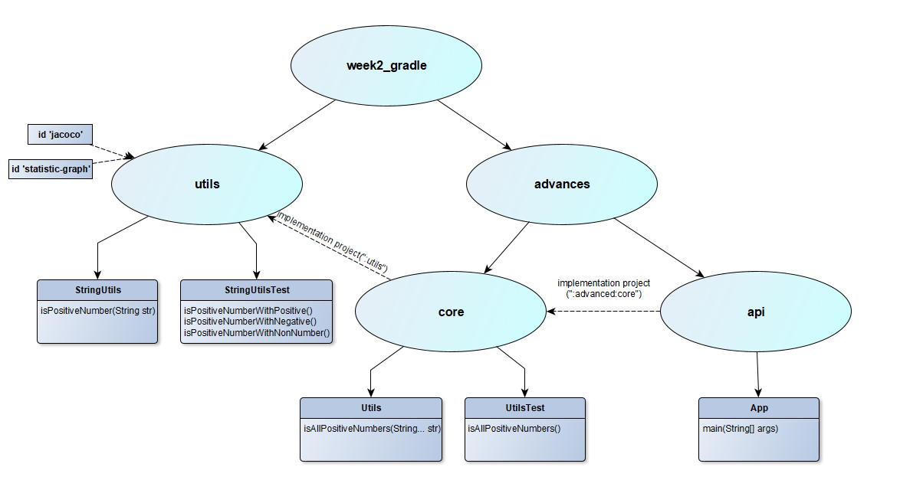

# Неделя 1 домашнее задание по Git

Это домашнее задание по теме GIT от компании Clevertec :clap:
---
___Содержание:___
* Используемый стек.
* Описание.
___     

# Используемый стек и библиотеки.
1. IntelliJ IDEA Community Edition (для проверки итоговых ветвлений)
2. GitHub (для удаленного хранения репозитория)
3. Gradle
4. jacoco plugin
5. Группа сокурсников в Telegram
___

# Описание.
- Схема проекта:

- Задания базового уровня сложности выполнены в подпроекте **utils**.
> **Пояснения к базовому заданию:**
> - настройка манифеста сделаны в build.gradle подпроекта.
> - в классе StringUtils обработку исключения не делал - предпочел пробросить, так метод можно будет 
переиспользовать для других задач, тем более что он boolean и не ясно какое поведение ожидается от него 
при использовании в случае неверного ввода исходных данных.
> - в тестовом классе сделана проверка, в том числе и на пробрасываемое исключение.

- Задания продвинутого уровня сложности выполнялись как в подпроекте **advanced**, так и частично в **utils**
> **Пояснения продвинутому заданию:**
> - подключена библиотека jacoco к подпроекту utils.
> - сделан кастомный плагин с id statistic-graph в папке buildSrc, который строит граф к подключаемому проекту, 
а также считает количество тасок выполняемых из этого проекта. К примеру при билде только проекта utils 
их может быть 12, а при билде проекта api всего 4..  это будет видно. Данный плагин подключен к проекту utils.
> - в проекте **advanced** созданы два подпроекта core и api, согласно ТЗ.
> - в подпроектах созданы базовые и тестовые классы, согласно ТЗ.
> - сделаны необходимые зависимости между проектами, необходимые проектам для использования классов из других проектов 
(направления - пунктирные стрелки на схеме).

###### CПАСИБО ЗА ВНИМАНИЕ !!!
